

  <picture>
    <source media="(prefers-color-scheme: dark)" srcset="assets/hero-dark.png">
    <source media="(prefers-color-scheme: light)" srcset="assets/hero-light.png">
    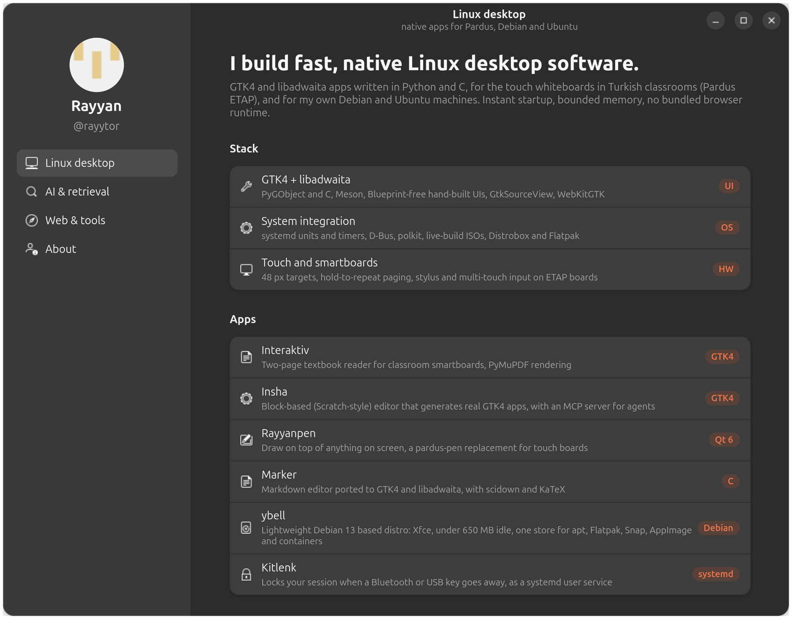
  </picture>

  Rayyan &nbsp;·&nbsp; Kahramanmaraş, Türkiye &nbsp;·&nbsp; <a href="https://rayytor.github.io">rayytor.github.io</a>

 

## Linux desktop

Native apps for the touch whiteboards in Turkish classrooms (Pardus ETAP) and for everyday Debian and Ubuntu machines. Instant startup, bounded memory, no bundled browser runtime.

<table>
  <tr>
    <td width="50%" valign="top">
      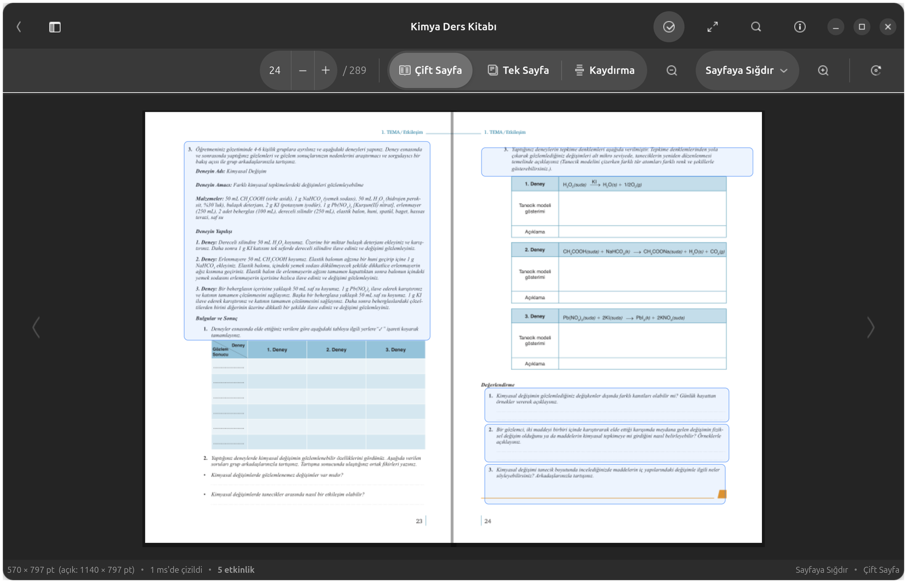 
      <b><a href="https://github.com/rayytor/interaktiv">Interaktiv</a></b> · School Edition 
      Textbook reader for classroom smartboards. Two-page book spread, activity hotspots with click-to-zoom, full-text search, four reading themes applied as GPU colour matrices. A spread draws in a millisecond or two, on a fixed memory budget. 
      <code>Python</code> <code>GTK4</code> <code>libadwaita</code> <code>PyMuPDF</code> <code>WebKitGTK</code>
    </td>
    <td width="50%" valign="top">
      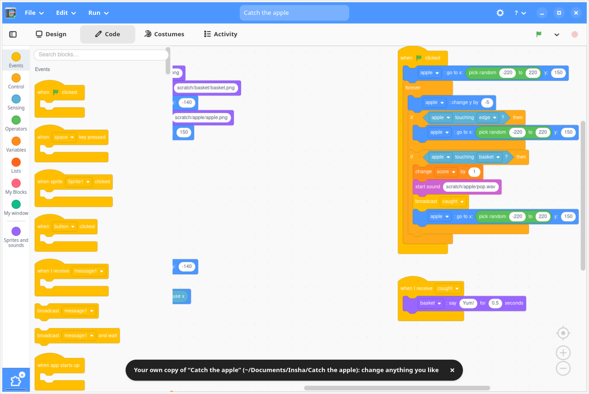 
      <b>Insha</b> 
      A block-based (no text) editor that builds real GTK4 + Python desktop apps. Humans drag Blockly blocks inside a native libadwaita window; AI agents edit the same project through a CLI and an MCP server. Both produce plain, readable PyGObject code. 
      <code>Python</code> <code>GTK4</code> <code>Blockly</code> <code>MCP</code>
    </td>
  </tr>
  <tr>
    <td width="50%" valign="top">
      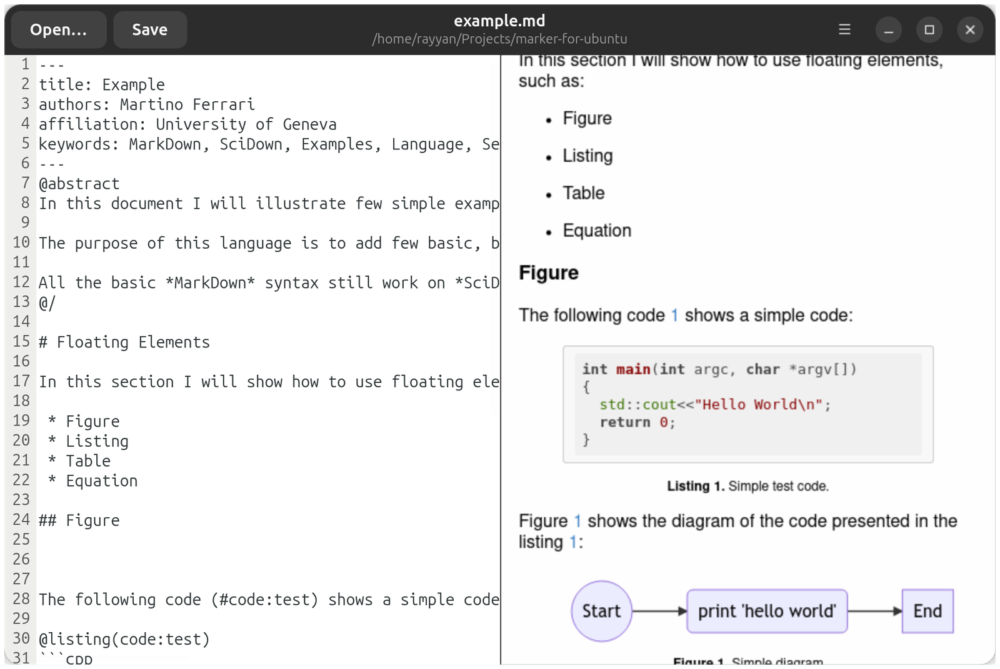 
      <b><a href="https://github.com/rayytor/kecheli">Marker</a></b> · GTK4 port 
      The Marker markdown editor brought to GTK4 and libadwaita: split editor and live preview, scidown scientific extensions, KaTeX math, beamer slides, sketch insertion. 
      <code>C</code> <code>GTK4</code> <code>GtkSourceView</code> <code>WebKitGTK</code> <code>Meson</code>
    </td>
    <td width="50%" valign="top">
      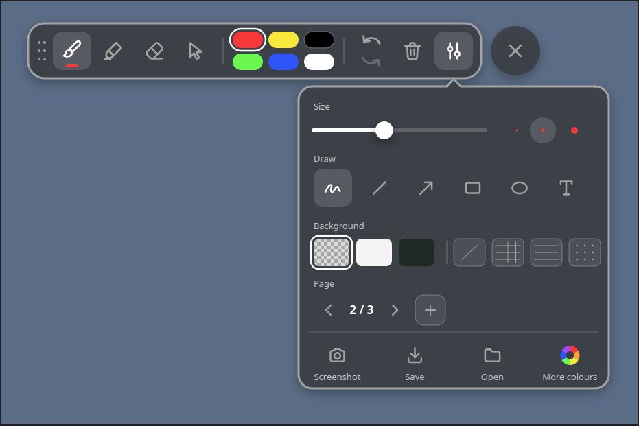 
      <b>Rayyanpen</b> 
      Draw on top of anything on a Linux screen: slides, web pages, video or a blank board. Built for ETAP touch whiteboards as a pardus-pen replacement, with the soft, smooth ink of the Draw on Screen browser extension. Fingers, styluses and mice all work. 
      <code>C++</code> <code>Qt 6</code> <code>Meson</code> <code>multi-touch</code>
    </td>
  </tr>
  <tr>
    <td width="50%" valign="top">
      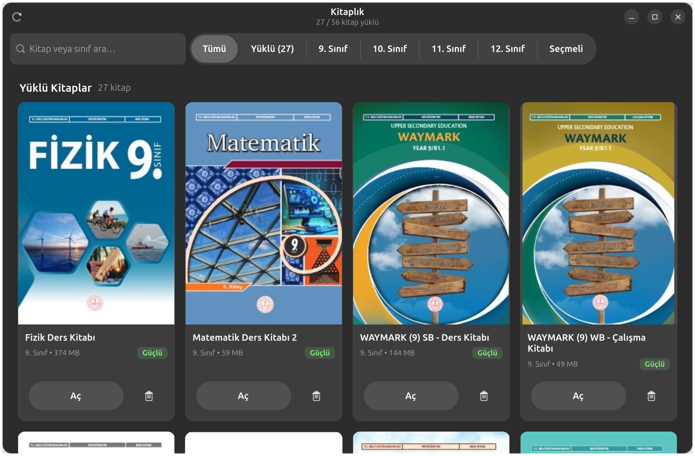 
      <b><a href="https://github.com/rayytor/interaktiv">Interaktiv</a></b> · library 
      The catalogue side of the same app: the MEB textbook list with grade filters, installs and previews, and finger-sized targets throughout.
    </td>
    <td width="50%" valign="top">
      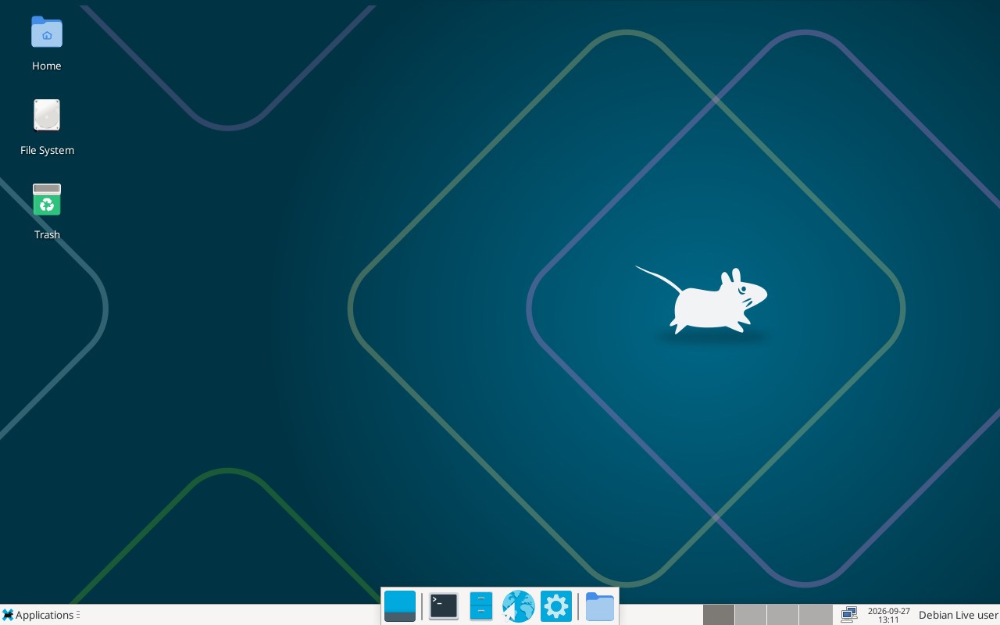 
      <b>ybell</b> · in progress 
      A lightweight Debian 13 based distribution whose whole point is compatibility: apt, Flatpak, Snap, AppImage, Fedora and Arch containers, Wine, Bottles and Proton, all behind one GTK4 store. Idle budget under 650 MB. Phase 1 boots; the store comes next. 
      <code>Debian 13</code> <code>live-build</code> <code>Xfce</code> <code>Distrobox</code> <code>GTK4</code>
    </td>
  </tr>
</table>

Also on the desktop side:

- **[Kitlenk](https://github.com/rayytor/Kitlenk)** turns any Bluetooth device or USB drive into a physical key for your session. A systemd user service locks the screen when the key goes away and unlocks when it returns, with hysteresis so a flaky connection never locks you out mid-sentence.
- **Gelgit** is a small Qt desktop app for GNOME that sets up Git and GitHub once (SSH keys, keyring, remote) and then gets out of the way.
- **[Pardus Builder](https://github.com/rayytor/pardus-builder)** is the public home for the block-based GTK4 and libadwaita builder. Empty for now, code lands soon.

 

## AI work

Retrieval, document understanding and small trained models, mostly aimed at Turkish schools.

<table>
  <tr>
    <td width="50%" valign="top">
      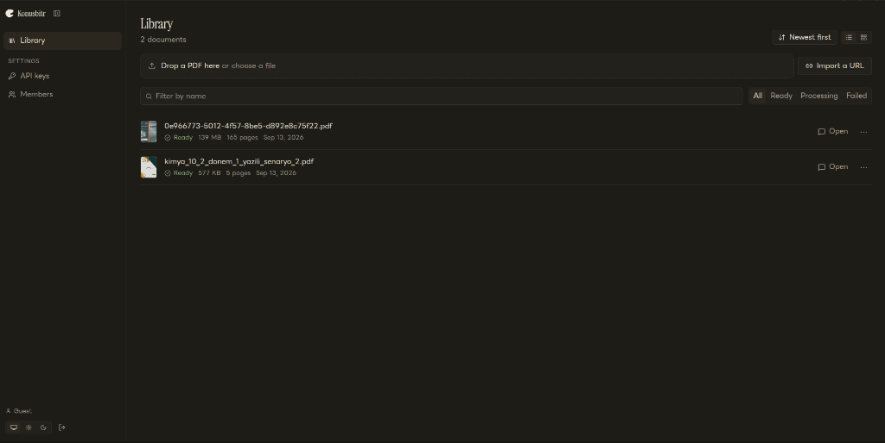 
      <b><a href="https://github.com/rayytor/konusbitr">Konusbitr</a></b> 
      Open-source, self-hostable alternative to PDF.ai. Upload documents, chat with them, and get answers with clickable citations that jump to the exact page and highlight the source. Exposes a PDF.ai-wire-compatible <code>/v2</code> REST API. 
      <code>Next.js</code> <code>FastAPI</code> <code>pgvector</code> <code>PyMuPDF</code> <code>Docker</code>
    </td>
    <td width="50%" valign="top">
      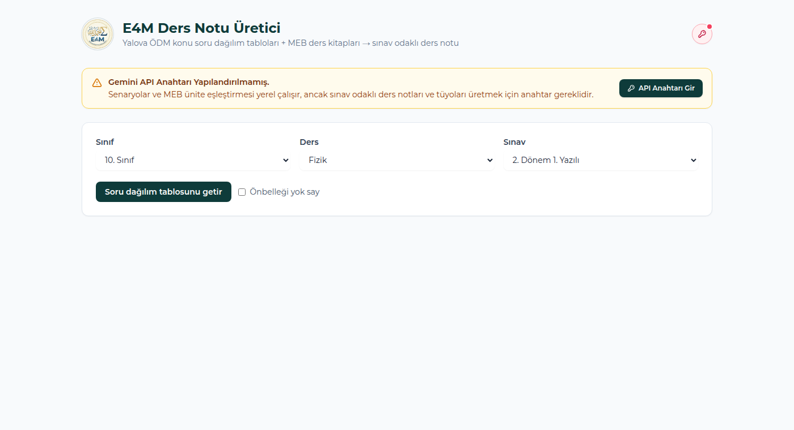 
      <b>E4M · Ders Notu Üretici</b> 
      Takes the official MEB question-distribution tables and the 100 to 400 MB MEB textbooks, slices the exact chapters an exam covers, and has Gemini write an exam-focused study note that prints pixel-for-pixel like the hand-made original. 
      <code>FastAPI</code> <code>Gemini</code> <code>PyMuPDF</code> <code>headless Chrome PDF</code>
    </td>
  </tr>
  <tr>
    <td width="50%" valign="top">
      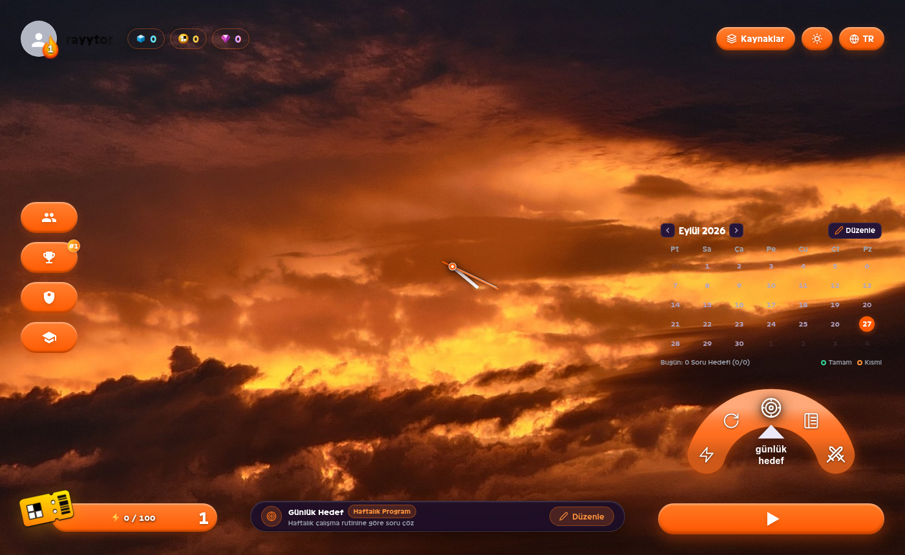 
      <b><a href="https://github.com/rayytor/denemedir">Denemedir</a></b> 
      TYT practice-exam app. Ingests official exam PDFs, builds custom tests per subject, tracks mistakes, and grades filled answer sheets with an OpenCV pipeline plus a small neural bubble classifier (MarkerAI) trained on synthetic data. 
      <code>Python</code> <code>OpenCV</code> <code>NumPy</code> <code>vanilla JS</code>
    </td>
    <td width="50%" valign="top">
      <b><a href="https://github.com/rayytor/trainai">trainai</a></b> 
      The training and annotation pipeline behind Denemedir's answer detector: synthetic dataset generation, a NumPy-only network, and an annotation server for real sheets.  
      <b>Insha for agents</b> 
      Insha's core is headless. Every project operation is a JSON op applied through a CLI or the built-in MCP server, so Claude Code and other agents can build, validate, screenshot and ship a GTK4 app without touching the GUI.  
      <b>Agent-driven development</b> 
      Larger projects here (ybell, Rayyanpen, Insha) are built phase by phase by fresh AI agents working from written briefs, with hard gates like idle-RAM budgets and golden-image tests keeping them honest.
    </td>
  </tr>
</table>

 

## Web and other work

<table>
  <tr>
    <td width="50%" valign="top">
      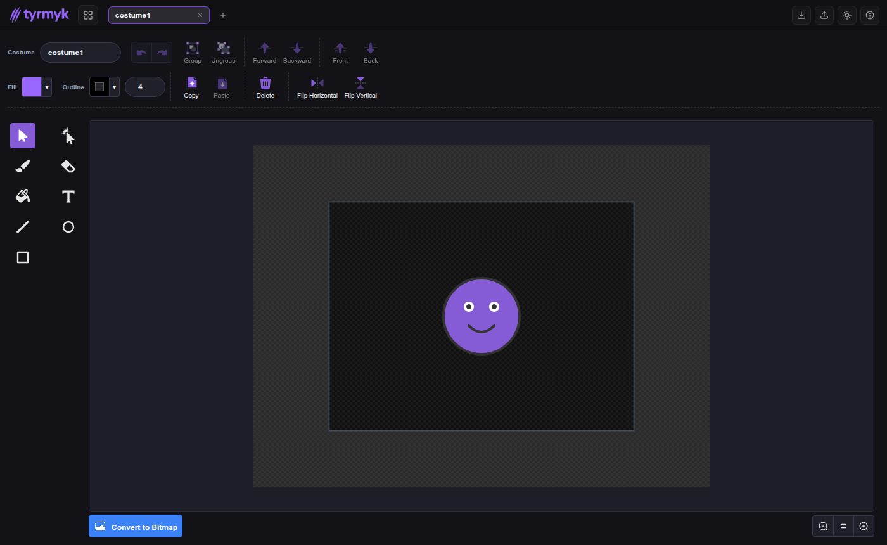 
      <b><a href="https://github.com/rayytor/tyrmyk">Tyrmyk</a></b> 
      Standalone, offline-first image editor: a rebranded and upgraded scratch-paint with vector and bitmap modes, multiple costumes, and IndexedDB storage. Installs as a PWA or runs as a desktop app. 
      <code>JavaScript</code> <code>Canvas</code> <code>PWA</code> <code>zero runtime deps</code>
    </td>
    <td width="50%" valign="top">
      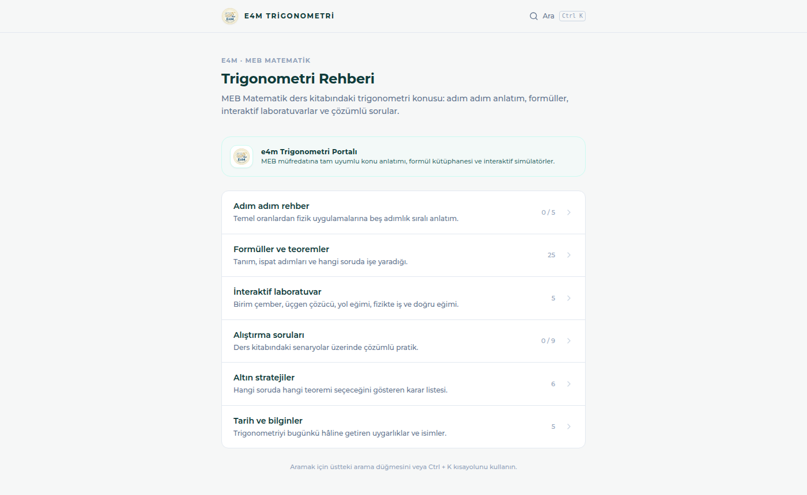 
      <b>Trigonometri Rehberi</b> 
      A study portal for the MEB trigonometry unit: step-by-step guides, a formula library with proofs, interactive labs (unit circle, triangle solver), solved problems and progress tracking. 
      <code>React</code> <code>TypeScript</code> <code>Vite</code>
    </td>
  </tr>
</table>

- **[Desloppify EBA](https://github.com/rayytor/desloppify-eba)** is a lightweight client for eba.gov.tr that strips the AI widgets, tracking scripts and UI clutter.
- **[Microphone extension for TurboWarp](https://github.com/rayytor/Microphone-Turbowarp-Extension)** gives Scratch projects real microphone input.

 

  Screenshots are of real builds on this machine. The libadwaita window at the top is rendered with <code>GskRenderer.render_texture</code> from a running GTK4 app.

